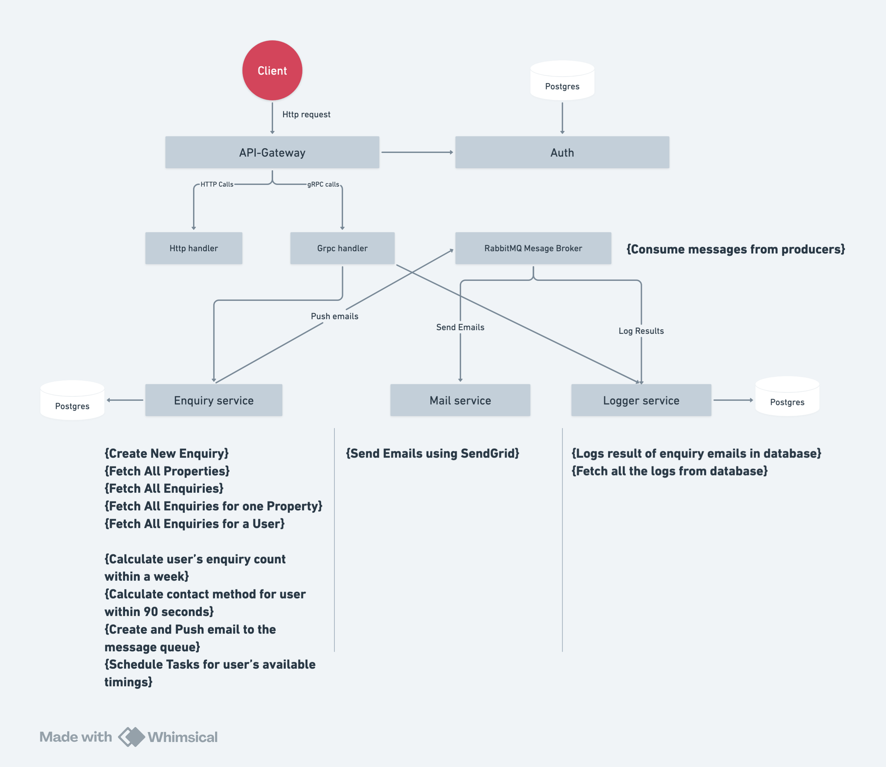

# Microservices with Golang

[](https://opensource.org/licenses/MIT)

## Table of Contents.

- [Introduction](#introduction)
- [Architecture](#architecture)
- [Getting Started](#getting-started)
  - [Prerequisites](#prerequisites)
  - [Installation](#installation)
  - [Running the Services](#running-the-services)
- [Services](#services)
  - [API Gateway](#api-gateway)
  - [Authentication Service](#authentication-service)
  - [Logger Service](#logger-service)
  - [Mailer Service](#mailer-service)
  - [Listener Service](#listener-service)
  - [Payment Service](#payment-service)
- [Technologies Used](#technologies-used)
- [Contributing](#contributing)
- [License](#license)

## Introduction

This repository contains a microservices-based application built with Golang. The application demonstrates how to use microservices to create a scalable and maintainable architecture. It includes services for authentication, logging, mailing, and a listener service that processes events from RabbitMQ.

## Architecture

The architecture is composed of multiple services that communicate with each other through REST APIs and message queues. The services are:

- **API Gateway**: The entry point for all client requests.
- **Authentication Service**: Handles user authentication.
- **Logger Service**: Logs application events.
- **Mailer Service**: Sends emails.
- **Listener Service**: Listens for events from RabbitMQ and processes them.
- **Payment Service**: Listens for gRPC calls from api-gateway to Process payments using credit card.


## Getting Started

### Prerequisites

Before you begin, ensure you have the following installed:

- [Golang](https://golang.org/doc/install)
- [Docker](https://docs.docker.com/get-docker/)
- [Docker Compose](https://docs.docker.com/compose/install/)

### Installation

1. Clone the repository:

    ```sh
    git clone https://github.com/Meenachinmay/microservices-golang.git
    cd microservices-golang
    ```

2. Create an `.env` file in the root directory and set the necessary environment variables. An example `.env` file is provided as `.env.example`.

    ```sh
    cp .env.example .env
    ```

### Running the Services

1. Build and run the services using Docker Compose using Makefile:

    ```sh
    make up_build
    ```

2. The services will be available at the following ports:

    - API Gateway: `http://localhost:8080`
    - Authentication Service: `http://localhost:8081`
    - Logger Service: `http://localhost:8082`
    - Mailer Service: `http://localhost:8083`
    - Listener Service: `http://localhost:8084`
    - Payment Service: `http://localhost:8085`

## Services

### API Gateway (Broker-service)

The API Gateway is the main entry point for all incoming requests. It routes requests to the appropriate service based on the action specified.

### Authentication Service

The Authentication Service handles user authentication. It provides endpoints for login, signup, and password reset. (as of now just login is there for simulation, I will add more like signup, session, cookies and everything)

### Logger Service

The Logger Service logs application events. It listens for log events from RabbitMQ and stores them in a log file.

### Mailer Service

The Mailer Service sends emails. It listens for mail events from RabbitMQ and sends emails using the configured SMTP server. (I am using mailhog as of now, later I will use sendgrid)

### Listener Service

The Listener Service listens for events from RabbitMQ and processes them. It handles log and mail events, delegating tasks to the appropriate services.

### Payment Service
The payment service uses stripe payment gateway API to enable credit card payment for now. Payment service
need to communicate with async calls with api-gateway and api-gateway with client, so for the communication
between api-gateway and Payment service I am enabling gRPC calls, rather than using RabbitMQ. 
In this service I planned to use rabbitMQ to generate email invoices for payments on a completion of 
successful payments from users.

## Technologies Used

- **Golang**: The primary language used for building the services.
- **Docker**: Used for containerizing the services.
- **Docker Compose**: Used for orchestrating the multi-container Docker application.
- **RabbitMQ**: Used for messaging between services.
- **PostgreSQL**: The database used by the Authentication Service.
- **MongoDB**: The database used by the Logger Service.
- **gRPC**: Communication method between api-gateway and other services where it needs async calls.

### Command to generate gRPC code 
``` sh 
     protoc --go_out=. --go_opt=paths=source_relative --go-grpc_out=. --go-grpc_opt=paths=source_relative <name of file>.proto
```

## Service methods and Diagram
## Services:
1. Api-gateway
2. Enquiry-service -> Postgres DB
3. Mail-service
4. Logger-service -> Postgres DB
5. Listener-service
6. frontend

### DB tables:
- users table
- enquiry tables
- schedules table
- logs tables

### Microservice communication
- http
- gRPC
- Rabbitmq message broker

### Containerization
- Docker

### Databases
- Postgres -> data store
- Redis -> Cache, Rate Limiting

### 3rd party API Integration
- Sendgrid

### Service wise methods
> ### Api-gateway
##### HTTP
```go
func HandleSubmission(c *gin.Context)
func (lac *LocalApiConfig) FetchAllProperties(c *gin.Context)
func connect() (*amqp.Connection, error)
```
##### gRPC
```go
func EnquiryViaGRPC(c *gin.Context, enquiryPayload types.EnquiryPayload)
func (lac *LocalApiConfig) GetAllLogs(c *gin.Context)
func (lac *LocalApiConfig) WriteLog(c *gin.Context)
func (lac *LocalApiConfig) CreateNewUser(c *gin.Context, userPayload types.UserPayload)
```

> ### Enquiry-service
##### HTTP
```go
func (localApiConfig *LocalApiConfig) HandleFetchAllProperties(c *gin.Context)
```
```go
func StartGrpcServer(localApiConfig *handlers.LocalApiConfig)
func connect() (*amqp.Connection, error)
func connectToDB() *sql.DB
func ProcessScheduledTasks(s *handlers.EnquiryServer)
```
##### handlers
```go
func StartGrpcUserServer(localApiConfig *handlers.LocalApiConfig)
func (e *EnquiryServer) HandleCustomerEnquiry(ctx context.Context, request *enquiries.CustomerEnquiryRequest) (*enquiries.CustomerEnquiryResponse, error)
func (e *EnquiryServer) getTotalEnquiriesLastWeek(c context.Context, updatedUser database.User) (int, error)
func (e *EnquiryServer) SendEmail(payload EnquiryMailPayloadUsingSendgrid) error
func (e *EnquiryServer) notifyUserAboutEnquiry(input *enquiries.CustomerEnquiry, totalEnquiries int, mailPayload EnquiryMailPayloadUsingSendgrid) error
func (e *EnquiryServer) executeTask(input *enquiries.CustomerEnquiry, mailPayload EnquiryMailPayloadUsingSendgrid) error
func (e *EnquiryServer) scheduleTask(input *enquiries.CustomerEnquiry, mailPayload EnquiryMailPayloadUsingSendgrid) error
func (u *UserServer) CreateNewUser(ctx context.Context, request *users.CreateUserRequest) (*users.CreateUserResponse, error)
```
##### rabbitmq actions
```go
func (e *Emitter) declareExchange(ch *amqp.Channel) error
func (e *Emitter) Emit(event string) error
func NewEmitter(conn *amqp.Connection, exchange, routingKey string) (*Emitter, error)
```
> ### Listener-service
##### rabbitmq actions
```go
func DeclareExchange(ch *amqp.Channel) error
func DeclareRandomQueue(ch *amqp.Channel) (amqp.Queue, error)
func DeclareMailExchange(ch *amqp.Channel) error
func DeclareMailQueue(ch *amqp.Channel) (amqp.Queue, error)
func DeclareEnquiryMailQueue(ch *amqp.Channel) (amqp.Queue, error)
func NewLogConsumer(conn *amqp.Connection) (*LogConsumer, error)
func (consumer *LogConsumer) ConsumeLogs(topics []string) error
func logEvent(log LogPayload) error
func NewMailConsumer(conn *amqp.Connection) (*MailConsumer, error)
func (consumer *MailConsumer) ConsumeMails() error
func (consumer *MailConsumer) ConsumeEnquiryMails() error
func sendEnquiryMail(payload EnquiryMailPayloadUsingSendgrid) (time.Duration, error)
func logMailSendingResult(payload EnquiryMailPayloadUsingSendgrid, elapsed time.Duration, err error) error
func startLogConsumer(conn *amqp.Connection)
func startMailConsumer(conn *amqp.Connection)
func startEnquiryMailConsumer(conn *amqp.Connection)
```
> ### Logger-service
##### HTTP
```go
func (apiConfig *LocalApiConfig) WriteLog(c *gin.Context)
```
##### gRPC
```go
func (l *LogServer) WriteLog(ctx context.Context, req *logs.LogRequest) (*logs.LogResponse, error)
func (l *LogServer) GetAllLogs(ctx context.Context, request *logs.GetAllLogsRequest) (*logs.GetAllLogsResponse, error)
func GRPCListener(localApiConfig *LocalApiConfig)
```
> ### Mail-service
##### HTTP
```go
func (app *Config) SendMailViaSendGrid(w http.ResponseWriter, r *http.Request)
```

### Diagram


## Contributing

Contributions are welcome! Please read the [CONTRIBUTING.md](./CONTRIBUTING.md) file for more information on how to contribute to this project.

## License

This project is licensed under the MIT License. See the [LICENSE](./LICENSE.md) file for details.
